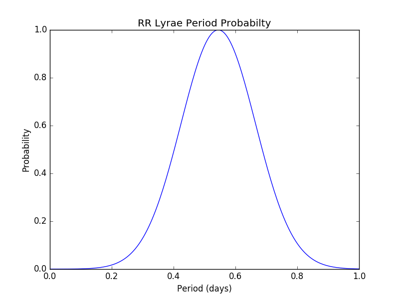

# RR Lyrae Analysis
This is the code used for performing analysis of RR Lyrae stars from the SMC.

## Results
The data calculated from the testing data sets is as follows:

Mean      | Standard Deviation
----------|-------------------
0.5445663 | 0.1208535

The generated probability function is the following:

## References
Data used was from the following paper:

- Soszyński et al., 2010, [Acta Astron., 60, 165](http://acta.astrouw.edu.pl/Vol60/n3/a_60_3_1.html) ([arXiv:1009.0528](https://arxiv.org/abs/1009.0528))
